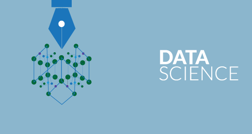

# Data-Science-Learning-Track

This repo just contains the project codes of the my practice during the Data Science Learning.

## Data Science
Data science can be defined as a blend of mathematics, business acumen, tools, algorithms and machine learning techniques, all of which help us in finding out the hidden insights or patterns from raw data which can be of major use in the formation of big business decisions.

## Things I learned
Tools and techniques which i learn during this are ;
* [SQL](#SQL)
* [SQL Features (Churn Analysis, Funnel Analysis & Marketing Attribution)](#SQL-Features)
* [Python](#Python)
* [Pandas](#Pandas)
* [Numpy](#Numpy)
* [Matplotlib and Seaborn](#Matplotlib-and-Seaborn)
* [Statistics with Python](#Statistics-with-Python)
* [Statistics with NumPy](#Statistics-with-NumPy)
* [Hypothesis Testing with SciPy](#Hypothesis-Testing-with-SciPy)
* [Data Cleaning](#Data-Cleaning)
* [Data Mining](#Data-Minning)
* [Data Anaylsis](#Data-Anaylsis)
* [Web Scrapping](#Web-Scrapping)
* [Machine Learning](#Machine-Learning)
	* [Supervised Learning](#Supervised-Learning)
		* [Linear Regression](#Linear-Regression)
		* [Multiple Linear Regression](#Multiple-Linear-Regression)
		* [K- Nearest Neighbors Regression](#K-Nearest-Neighbors-Regression)
		* [Classification](#Classification)
		* [Logistic Regression](#Logistic-Regression)
		* [Support Vector Machine](#Support-Vector-Machine)
		* [Decision Tree](#Decision-Tree)
		* [Navies Bayes](#Navies-Bayes)
	 	* [AI Decision Making (MiniMax_)](#AI-Decision-Making(MiniMax)
	* [Unsupervised Learning](#Unsupervised-Learning)
	* [Preceptron and Neural Nets](#Preceptron-and-NeuralNets)
	* [Natrual language Processing](#Natrual-language-Processing)
	
### List of Content
  #### SQL
SQL (Structured Query Language) is a programming language used to communicate with data stored in a relational database management system. SQL syntax is similar to the English language, which makes it relatively easy to write, read, and interpret.

Many RDBMSs use SQL (and variations of SQL) to access the data in tables. For example, SQLite is a relational database management system. SQLite contains a minimal set of SQL commands (which are the same across all RDBMSs). Other RDBMSs may use other variants.

(SQL is often pronounced in one of two ways. You can pronounce it by speaking each letter individually like “S-Q-L”, or pronounce it using the word “sequel”.)

 #### SQL Features
* ##### Funnel Anaylsis
A funnel is a marketing model which illustrates the theoretical customer journey towards the purchase of a product or service. Oftentimes, we want to track how many users complete a series of steps and know which steps have the most number of users giving up.

Some examples include:

Answering each part of a 5 question survey on customer satisfaction
Clicking “Continue” on each step of a set of 5 onboarding modals
Browsing a selection of products → Viewing a shopping cart → Making a purchase
Generally, we want to know the total number of users in each step of the funnel, as well as the percent of users who complete each step.

 * ##### Churn Anaylsis
 Customer churn is when a customer decides to stop using products or services from a company. Churn rate is the percent of subscribers that have canceled within a certain period.
 
 Calculation of a monthly customer churn rate is the number of customers who churned in the month divided by the total number of customers in the month. For example, if you had 100 customers at the beginning of the month and during month 5 of them canceled their subscriptions, customer churn rate is 5% (5/100). Here is a simple formula for calculating customer churn:

* ##### Marketing Attribuitions
The Short Definition: Put simply, marketing attribution is the analytical science of determining which marketing tactics are contributing to sales or conversions. Marketing attribution is the practice of evaluating the marketing touchpoints a consumer encounters on their path to purchase.

 #### Python
 Python is a programming language. Like other languages, it gives us a way to communicate ideas. In the case of a programming language, these ideas are “commands” that people use to communicate with a computer!

We convey our commands to the computer by writing them in a text file using a programming language. These files are called programs. Running a program means telling a computer to read the text file, translate it to the set of operations that it understands, and perform those actions.

 #### Pandas 
 Pandas is a Python module for working with tabular data (i.e., data in a table with rows and columns). Tabular data has a lot of the same functionality as SQL or Excel, but Pandas adds the power of Python.
 #### Numpy
 NumPy is a library for the Python programming language, adding support for large, multi-dimensional arrays and matrices, along with a large collection of high-level mathematical functions to operate on these arrays
 #### Matplotlib and Seaborn
 * ##### Matplotlib 
  Matplotlib. pyplot is a collection of command style functions that make matplotlib work like MATLAB. Each pyplot function makes some change to a figure: e.g., creates a figure, creates a plotting area in a figure, plots some lines in a plotting area, decorates the plot with labels, etc
  
 * ##### Seaborn
 Seaborn is a library that uses Matplotlib underneath to plot graphs. It will be used to visualize random distributions.
 #### Statistics with Python
 Statistics is the discipline that concerns the collection, organization, analysis, interpretation and presentation of data. In applying statistics to a scientific, industrial, or social problem, it is conventional to begin with a statistical population or a statistical model to be studied. 
 *	Mean, Median and Mode
 *	Variance and Standard deviation
 *	Quartiles, Quantiles and InterQuatile Range
 *	Histogram and Boxplot
 #### Statsitics with Numpy
 NumPy has quite a few useful statistical functions for finding minimum, maximum, percentile standard deviation and variance, etc
 
 #### Hypothesis Testing With Scipy
Hypothesis testing is an act in statistics whereby an analyst tests an assumption regarding a population parameter. The methodology employed by the analyst depends on the nature of the data used and the reason for the analysis. Hypothesis testing is used to assess the plausibility of a hypothesis by using sample data.
 #### Data Cleaning
 Data cleaning is the process of detecting and correcting corrupt or inaccurate records from a record set, table, or database and refers to identifying incomplete, incorrect, inaccurate or irrelevant parts of the data and then replacing, modifying, or deleting the dirty or coarse data.
 #### Data Mining
 Data mining is a process of discovering patterns in large data sets involving methods at the intersection of machine learning, statistics, and database systems.
 #### Data Anaylsis
 Data analysis is a process of inspecting, cleansing, transforming and modeling data with the goal of discovering useful information, informing conclusions and supporting decision-making.
 #### Web Scraping
 Web Scraping (also termed Screen Scraping, Web Data Extraction, Web Harvesting etc.) is a technique employed to extract large amounts of data from websites whereby the data is extracted and saved to a local file in your computer or to a database in table.
 #### Machine Learning
 Machine learning is an application of artificial intelligence (AI) that provides systems the ability to automatically learn and improve from experience without being explicitly programmed. Machine learning focuses on the development of computer programs that can access data and use it learn for themselves.
 ##### Supervised Learning
 Supervised learning is the machine learning task of learning a function that maps an input to an output based on example input-output pairs. It infers a function from labeled training data consisting of a set of training examples.
 ###### Linear Regression
 Linear regression models are used to show or predict the relationship between two variables or factors. The factor that is being predicted (the factor that the equation solves for) is called the dependent variable.
 ###### Multiple Linear Regression
 Multiple linear regression (MLR), also known simply as multiple regression, is a statistical technique that uses several explanatory variables to predict the outcome of a response variable. Multiple regression is an extension of linear (OLS) regression that uses just one explanatory variable.
 ###### K-Nearest Neighbors Regression
 K nearest neighbors is a simple algorithm that stores all available cases and predict the numerical target based on a similarity measure (e.g., distance functions). KNN has been used in statistical estimation and pattern recognition already in the beginning of 1970's as a non-parametric technique.
 ######  Classification
 The definition of classifying is categorizing something or someone into a certain group or system based on certain characteristics. An example of classifying is assigning plants or animals into a kingdom and species. An example of classifying is designating some papers as "Secret" or "Confidential."
  
 ######  Logistic Regression
 Like all regression analyses, the logistic regression is a predictive analysis. Logistic regression is used to describe data and to explain the relationship between one dependent binary variable and one or more nominal, ordinal, interval or ratio-level independent variables.
 ######  Support Vector Machine
 A support vector machine (SVM) is a supervised machine learning model that uses classification algorithms for two-group classification problems. After giving an SVM model sets of labeled training data for each category, they're able to categorize new text. So you're working on a text classification problem
 ######  Decision Tree
 Decision Tree - Classification. Decision tree builds classification or regression models in the form of a tree structure. It breaks down a dataset into smaller and smaller subsets while at the same time an associated decision tree is incrementally developed. The final result is a tree with decision nodes and leaf nodes
 ######  Navies Bayes
 A naive Bayes classifier assumes that the presence (or absence) of a particular feature of a class is unrelated to the presence (or absence) of any other feature, given the class variable. ... Basically, it's "naive" because it makes assumptions that may or may not turn out to be correct.
 ###### AI Decision Making ( MiniMax )
 Given a game state, the minimax algorithm finds the decision that maximizes the minimum gain. In other words, if you assume your opponent will make decisions that minimize your gain, the algorithm finds the move that will maximize it based on the options your opponent gives you.
 
 ##### Unsupervised Learning
 Unsupervised learning is a type of machine learning algorithm used to draw inferences from datasets consisting of input data without labeled responses. The most common unsupervised learning method is cluster analysis, which is used for exploratory data analysis to find hidden patterns or grouping in data.
 ##### Preceptron and Neural Nets
 A Perceptron is an algorithm used for supervised learning of binary classifiers. Binary classifiers decide whether an input, usually represented by a series of vectors, belongs to a specific class. In short, a perceptron is a single-layer neural network
 
 A neural network is a series of algorithms that endeavors to recognize underlying relationships in a set of data through a process that mimics the way the human brain operates. In this sense, neural networks refer to systems of neurons, either organic or artificial in nature.
 ##### Natrual language Processing
 Natural Language Processing (NLP) is a branch of Artificial Intelligence (AI) that studies how machines understand human language. Its goal is to build systems that can make sense of text and perform tasks like translation, grammar checking, or topic classification
